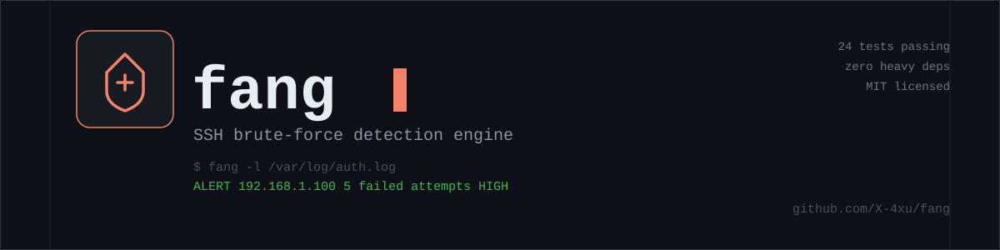

# Fang: SSH Security & Brute-Force Log Analyzer



[](https://github.com/X-4xu/fang/actions)
[](https://www.python.org/downloads/)
[](https://opensource.org/licenses/MIT)
[](https://github.com/psf/black)

**Fang** is a lightweight, secure, and standalone Python security tool designed to monitor and parse Linux authentication logs (`/var/log/auth.log` and `/var/log/secure`), detect suspicious SSH login activity and brute-force attacks, and export structured JSON security alerts.

Built with a **defensive-only, zero-trust** mindset, Fang treats all log data as untrusted text, enforces strict IP validation, and guarantees deterministic detection without heavy dependencies or system overhead.

---

## Architecture Overview

```
                      +-----------------------------+
                      |   /var/log/auth.log         |
                      |   /var/log/secure           |
                      |   (*.log or rotated *.gz)   |
                      +--------------+--------------+
                                     |
                                     v
                      +-----------------------------+
                      |       SshLogParser          |
                      |  - RFC 3339 & BSD Syslog    |
                      |  - ipaddress validation     |
                      |  - Control char stripping   |
                      |  - Memory-safe streaming    |
                      +--------------+--------------+
                                     |
                                     v  (SshAuthEvent stream)
                      +-----------------------------+
                      |     BruteForceDetector      |
                      |  - In-memory sliding window |
                      |  - Eviction by timestamp    |
                      |  - Threshold trigger        |
                      |  - Alert cooldown & dedup   |
                      |  - Dynamic severity rating  |
                      +--------------+--------------+
                                     |
                                     v  (SecurityAlert stream)
                      +-----------------------------+
                      |       Action Handlers       |
                      +--------------+--------------+
                                     |
        +----------------------------+----------------------------+
        |                                                         |
        v                                                         v
+-------------------------------+                         +-------------------------------+
|      ConsoleAlertHandler      |                         |       ReportExporter          |
|  - Real-time colored panels   |                         |  - Structured JSON report     |
|  - Incident summary tables    |                         |  - Evidence event chain       |
+-------------------------------+                         +-------------------------------+
                                                                  |
                                                                  v
                                                  +-------------------------------+
                                                  |    NetAccessControllerHook    |
                                                  |  (Extensible Hook for Future  |
                                                  |   Automated IP Blocking)      |
                                                  +-------------------------------+
```

---

## Key Features

- **Multi-Format Parsing**:
  - **Traditional BSD Syslog**: `Sep 19 14:32:10 host sshd[123]: Failed password for root from ...` (with automatic year rollover inference).
  - **Modern RFC 3339 / ISO 8601**: `2026-09-19T08:12:34.567890+00:00 host sshd[123]: ...` (used by modern `systemd-journald` and Debian/Ubuntu releases).
  - **Rotated Compressed Logs**: Reads `.gz` archives (e.g. `auth.log.1.gz`) seamlessly without manual unzipping.
- **Sliding-Window Brute-Force Engine**:
  - Employs a rolling time window (e.g., 5 failed attempts in 60 seconds) rather than static minute-aligned buckets.
  - Automatic time-based eviction prevents false positives on slow/legitimate typos.
- **Dynamic Severity Scoring**:
  - `CRITICAL`: $\ge 20$ attempts or $\ge 10$ attempts targeting privileged accounts (`root`, `admin`, `wheel`).
  - `HIGH`: $\ge 10$ attempts or any targeting of privileged accounts.
  - `MEDIUM`: Base threshold met ($\ge 5$ attempts within window).
- **Anti-Spam Cooldown**:
  - Suppresses duplicate alert spam for ongoing attacks from the same IP within a configurable cooldown window.
- **Traceable Evidence Chain**:
  - Every alert contains the full raw log lines, original timestamps, targeted usernames, and port numbers.
- **Future Integration Ready**:
  - Includes a clean, safe extension point interface (`NetAccessControllerHook`) to integrate with `net-access-controller` for automated IP blocking in future deployments.

---

## Installation

### From Source

```bash
git clone https://github.com/X-4xu/fang.git
cd fang
python -m venv .venv
source .venv/bin/activate  # On Windows: .venv\Scripts\activate
pip install -e .
```

### Install with Development Dependencies

```bash
pip install -e ".[dev]"
```

---

## Quick Start & CLI Usage

### Basic Scan

Scan the default system log (`/var/log/auth.log`):

```bash
sudo fang
```

### Scan RedHat / CentOS / Rocky Linux Log

```bash
sudo fang --log-file /var/log/secure
```

### Scan Rotated Gzip Archive

```bash
sudo fang --log-file /var/log/auth.log.1.gz
```

### Custom Threshold and Window

Detect 10 or more failed attempts within a 2-minute (120 seconds) window, exporting to JSON:

```bash
fang --log-file /var/log/auth.log --threshold 10 --window 120 --output /var/log/fang_report.json
```

### CI/CD / Automation Mode

Exit with status code `2` if any brute-force incident is detected (useful for automated security pipelines and cron monitoring):

```bash
fang --log-file /var/log/auth.log --exit-code-on-alert --quiet -o report.json
```

---

## Command-Line Options

| Option | Flag | Default | Description |
|---|---|---|---|
| `--log-file` | `-l` | `/var/log/auth.log` | Path to log file (`/var/log/auth.log`, `/var/log/secure`, plaintext or `.gz`). |
| `--threshold` | `-t` | `5` | Minimum failed attempts to trigger an alert. |
| `--window` | `-w` | `60` | Duration of the sliding time window in seconds. |
| `--cooldown` | `-c` | `300` | Cooldown period in seconds per source IP to prevent alert spam. |
| `--output` | `-o` | `None` | Path to save the structured JSON report. |
| `--enable-net-access-hook` | | `False` | Enable dry-run hook for `net-access-controller`. |
| `--quiet` | `-q` | `False` | Suppress real-time alert panels; show only the summary table. |
| `--verbose` | `-v` | `False` | Enable verbose debug logging. |
| `--exit-code-on-alert` | | `False` | Exit with return code `2` if an alert is detected. |
| `--version` | | | Display version information. |

---

## Sample Output

### Terminal Alert Panel

When Fang detects a brute-force pattern during analysis, it immediately renders an alert panel:

```
+----------------- FANG ALERT: SSH BRUTE-FORCE DETECTED ------------------+
| Alert ID: ALERT-FANG-3B1B67A5                                           |
| Source IP: 192.168.1.100                                                |
| Severity: HIGH                                                          |
| Failed Attempts: 5 (in 60s window)                                      |
| Time Range: 2026-09-19 10:00:10 -> 10:00:22                             |
| Target Users: admin, test, guest, root                                  |
| Target Ports: 40001, 40002, 40003, 40004                                 |
| Pattern: SSH Brute-Force: 5 failed attempts in 12.0s (Threshold: 5/60s) |
+-------------------------------------------------------------------------+
```

### Terminal Summary Table

```
               Fang: SSH Security Analysis Summary                
+----------------------------------------------------------------+
| Metric                       | Value                           |
|------------------------------+---------------------------------|
| Log File Path                | /var/log/auth.log               |
| Total Lines Scanned          | 1,420                           |
| SSH Events Parsed            | 840                             |
| Failed Login Attempts        | 124                             |
| Unique Source IPs            | 12                              |
| Brute-Force Alerts Triggered | 2                               |
| Execution Time               | 0.045s                          |
+----------------------------------------------------------------+

                        Detected Brute-Force Incidents                         
+-----------------------------------------------------------------------------+
| Alert ID            | Source IP     | Severity | Attempts | Target Users    |
|---------------------+---------------+----------+----------+-----------------|
| ALERT-FANG-3B1B67A5 | 192.168.1.100 |   HIGH   |        5 | admin, root     |
| ALERT-FANG-92FA4C10 | 203.0.113.42  | CRITICAL |       18 | root, oracle    |
+-----------------------------------------------------------------------------+
```

---

## Structured JSON Report Schema

When running with `--output <path>`, Fang produces structured JSON reports:

```json
{
  "schema_version": "1.0.0",
  "analyzer_version": "1.0.0",
  "generated_at": "2026-09-19T18:57:53.390261+00:00",
  "summary": {
    "log_file_path": "/var/log/auth.log",
    "total_lines_read": 1420,
    "total_events_parsed": 840,
    "failed_attempts_count": 124,
    "unique_source_ips": 12,
    "alerts_triggered": 1,
    "scan_start_time": "2026-09-19T18:57:53.379829+00:00",
    "scan_end_time": "2026-09-19T18:57:53.390230+00:00",
    "scan_duration_seconds": 0.045
  },
  "alerts_count": 1,
  "alerts": [
    {
      "alert_id": "ALERT-FANG-3B1B67A5",
      "source_ip": "192.168.1.100",
      "severity": "high",
      "pattern": "SSH Brute-Force: 5 failed attempts in 12.0s (Threshold: 5/60s)",
      "failed_attempts_count": 5,
      "window_seconds": 60,
      "time_range": {
        "start": "2026-09-19T10:00:10+00:00",
        "end": "2026-09-19T10:00:22+00:00",
        "duration_seconds": 12.0
      },
      "target_usernames": ["admin", "root", "test"],
      "ports": [40001, 40002, 40003, 40004],
      "detected_at": "2026-09-19T18:57:53.384141+00:00",
      "evidence": [
        {
          "timestamp": "2026-09-19T10:00:10+00:00",
          "event_type": "FAILED_PASSWORD",
          "source_ip": "192.168.1.100",
          "port": 40001,
          "username": "admin",
          "is_invalid_user": true,
          "line_number": 2,
          "raw_line": "Sep 19 10:00:10 web-server sshd[2001]: Failed password for invalid user admin from 192.168.1.100 port 40001 ssh2"
        }
      ]
    }
  ]
}
```

---

## Extension Point: `net-access-controller`

Fang is architected with a decoupled `ActionHandler` pattern. This enables seamless future integration with remediation tools such as **`net-access-controller`** to execute automated IP blocks without modifying the parsing or detection engines.

### Safe by Design
- **No Automatic Blocking in v1.0**: Active blocking is intentionally omitted in this release.
- **Strict Safety Whitelist**: The hook enforces hardcoded immunity for loopback addresses (`127.0.0.1`, `::1`) and configured administrator IP ranges.
- **Canonical Payload Generator**: Calling `NetAccessControllerHook.build_block_payload(alert)` creates the exact schema expected by `net-access-controller`:

```json
{
  "schema_version": "1.0",
  "action": "BLOCK_IP",
  "target_ip": "192.168.1.100",
  "reason": "SSH Brute-Force: 5 failed attempts in 12.0s (Threshold: 5/60s)",
  "severity": "high",
  "suggested_duration_seconds": 14400,
  "evidence": {
    "alert_id": "ALERT-FANG-3B1B67A5",
    "failed_attempts": 5,
    "time_window_seconds": 60,
    "targeted_usernames": ["admin", "root"]
  },
  "triggered_by": "fang"
}
```

To test the integration point in dry-run mode:
```bash
fang --log-file /var/log/auth.log --enable-net-access-hook
```

---

## Security Invariants & Defensive Design

1. **Passive Inspection Only**: Fang never attempts network egress, packet manipulation, or reverse connections.
2. **Untrusted Data Isolation**: Usernames, hosts, and raw log lines are stripped of non-printable ASCII control characters. Under no circumstances are parsed log fields passed to subshells or `eval()`.
3. **Strict IP Validation**: All extracted IP candidates must pass Python's `ipaddress.ip_address()` validator. Malformed or spoofed IP fields in logs are discarded.
4. **Denial-of-Service Defense**: Line lengths are capped at 4,096 characters to prevent ReDoS on corrupted or intentionally adversarial log streams. Streaming file readers ensure minimal memory consumption even on multi-gigabyte log archives.

---

## Testing

Fang comes with a comprehensive test suite covering unit, integration, and malformed log edge cases.

```bash
# Run full test suite
pytest -v

# Run with test coverage
pytest --cov=fang --cov-report=term-missing
```

---

## License

This project is licensed under the [MIT License](LICENSE).
